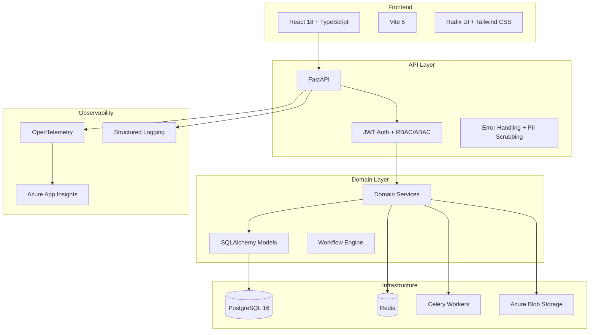

# Architecture Overview

## System Architecture



## Directory Structure

```
src/
├── api/                    # API layer (FastAPI routes)
│   ├── dependencies/       # Dependency injection (auth, DB, tenant)
│   ├── middleware/          # Error handlers, request processing
│   ├── routes/             # Route handlers (45+ modules)
│   ├── schemas/            # Pydantic response models
│   └── utils/              # Shared pagination, entity lookup, update helpers
├── core/                   # Core configuration and security
│   ├── config.py           # Application settings
│   └── security.py         # JWT, password hashing, token management
├── domain/                 # Domain layer
│   ├── models/             # SQLAlchemy ORM models (30+ entities)
│   └── services/           # Business logic services (25+ services)
├── infrastructure/         # Infrastructure layer
│   ├── cache/              # Redis cache with connection pooling
│   ├── database.py         # Async SQLAlchemy engine + session
│   ├── file_validation.py  # Upload security (magic numbers, size limits)
│   ├── logging/            # PII scrubbing filters
│   ├── monitoring/         # OpenTelemetry + Azure Monitor
│   ├── storage.py          # Azure Blob Storage client
│   └── tasks/              # Celery background tasks
└── main.py                 # FastAPI application entry point

frontend/src/
├── api/                    # API client
├── components/             # Reusable UI components
├── contexts/               # React contexts (auth, theme)
├── pages/                  # Page components (30+ pages)
├── services/               # Frontend services
└── stores/                 # Zustand state management
```

## ISO Standards Supported

| Standard | Scope |
|----------|-------|
| ISO 9001 | Quality Management |
| ISO 14001 | Environmental Management |
| ISO 27001 | Information Security |
| ISO 45001 | Occupational Health & Safety |

## Key Design Decisions

See `docs/adrs/` for Architecture Decision Records.

## Data Flow

### Incident Reporting Flow
1. User submits incident via frontend form
2. FastAPI validates input with Pydantic schemas
3. Route handler delegates to `ReferenceNumberService` for auto-numbering
4. Incident saved to PostgreSQL via async SQLAlchemy
5. Celery task dispatched for email notifications
6. Audit trail entry created automatically
7. Real-time notification pushed via WebSocket

### Authentication Flow
1. User authenticates with credentials
2. JWT access + refresh tokens issued with `jti` claims
3. Tokens validated on each request via `CurrentUser` dependency
4. Token revocation checked against blacklist table
5. Tenant isolation enforced via `verify_tenant_access`
