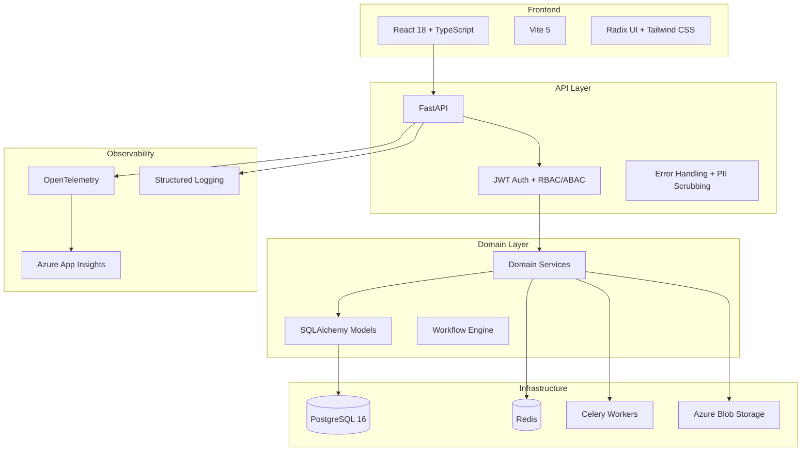

# Architecture Overview

## System Architecture



## Directory Structure

```
src/
├── api/                    # API layer (FastAPI routes)
│   ├── dependencies/       # Dependency injection (auth, DB, tenant)
│   ├── middleware/          # Error handlers, request processing
│   ├── routes/             # Route handlers (45+ modules)
│   ├── schemas/            # Pydantic response models
│   └── utils/              # Shared pagination, entity lookup, update helpers
├── core/                   # Core configuration and security
│   ├── config.py           # Application settings
│   └── security.py         # JWT, password hashing, token management
├── domain/                 # Domain layer
│   ├── models/             # SQLAlchemy ORM models (30+ entities)
│   └── services/           # Business logic services (25+ services)
├── infrastructure/         # Infrastructure layer
│   ├── cache/              # Redis cache with connection pooling
│   ├── database.py         # Async SQLAlchemy engine + session
│   ├── file_validation.py  # Upload security (magic numbers, size limits)
│   ├── logging/            # PII scrubbing filters
│   ├── monitoring/         # OpenTelemetry + Azure Monitor
│   ├── storage.py          # Azure Blob Storage client
│   └── tasks/              # Celery background tasks
└── main.py                 # FastAPI application entry point

frontend/src/
├── api/                    # API client
├── components/             # Reusable UI components
├── contexts/               # React contexts (auth, theme)
├── pages/                  # Page components (30+ pages)
├── services/               # Frontend services
└── stores/                 # Zustand state management
```

## ISO Standards Supported

| Standard | Scope |
|----------|-------|
| ISO 9001 | Quality Management |
| ISO 14001 | Environmental Management |
| ISO 27001 | Information Security |
| ISO 45001 | Occupational Health & Safety |

## Multi-Tenant Isolation

Every data-bearing model includes a `tenant_id` foreign key that scopes records to a single tenant. Isolation is enforced at three layers:

| Layer | Mechanism |
|-------|-----------|
| **Route / dependency** | `verify_tenant_access` dependency extracts the tenant from the authenticated JWT and rejects cross-tenant requests before any query executes. |
| **Query filtering** | All list/detail endpoints append `.where(Model.tenant_id == current_user.tenant_id)` so that even a missing dependency check cannot leak data. |
| **Cache scoping** | Cache keys are prefixed with `tenant:{tenant_id}:` and the `invalidate_tenant_cache` helper deletes only the calling tenant's keys on mutation. |

### Models with tenant_id

Incident, Risk, AuditTemplate, AuditRun, AuditFinding, Policy, Complaint, CAPA, Investigation, NearMiss, RTA, RiskRegister, Workflow, KRI, Document, Notification.

### Route files with tenant filtering (49 endpoints)

incidents, risks, audits, policies, complaints, capa, investigations, near_miss, rtas, risk_register, compliance, workflow, kri, document_control, uvdb, tenants.

## API Standardization (Shared Utilities)

Route handlers share three utility functions from `src/api/utils/` to eliminate boilerplate and enforce consistent behaviour:

| Utility | Purpose | Adoption |
|---------|---------|----------|
| `paginate(query, page, page_size)` | Consistent offset pagination with `items`, `total`, `pages` response shape | 20+ route files |
| `get_or_404(db, Model, id, tenant_id=)` | Fetches a single entity or raises `404` with a structured error body; optional tenant scoping | 12+ route files |
| `apply_updates(instance, data)` | Applies a Pydantic partial-update dict to an ORM instance, skipping `None` values | 4+ route files |

All endpoints declare an explicit `response_model` so that OpenAPI docs are fully typed.

## Error Handling

Errors pass through `src/api/middleware/error_handler.py` which maps exceptions to a standard JSON envelope:

```json
{
  "error": {
    "code": "RESOURCE_NOT_FOUND",
    "message": "Incident 42 not found",
    "details": {}
  }
}
```

`ErrorCode` is an enum (`src/api/schemas/error_codes.py`) that assigns a stable string code to every anticipated failure mode, enabling frontend clients to branch on codes rather than HTTP status alone.

## Testing Strategy

| Layer | Tool | Threshold | Notes |
|-------|------|-----------|-------|
| Backend unit | pytest + pytest-cov | 55 % (CI gate) | Covers services, models, utilities |
| Backend integration | pytest + httpx AsyncClient | 45 % | Full request cycle against test DB |
| Frontend unit | Vitest + jsdom | Enforced via @vitest/coverage-v8 | 71 tests across 8 component/page files |
| Frontend E2E | Playwright | — | 4 user-journey specs (dashboard, audits, risks, investigations) |
| Security | pip-audit, safety, bandit | CI gate | Dependency + static analysis |

Frontend tests are **blocking** in CI — failures prevent merge.

## Key Design Decisions

See `docs/adrs/` for Architecture Decision Records.

## Data Flow

### Incident Reporting Flow
1. User submits incident via frontend form
2. FastAPI validates input with Pydantic schemas
3. Route handler delegates to `ReferenceNumberService` for auto-numbering
4. Incident saved to PostgreSQL via async SQLAlchemy
5. Celery task dispatched for email notifications
6. Audit trail entry created automatically
7. Real-time notification pushed via WebSocket

### Authentication Flow
1. User authenticates with credentials
2. JWT access + refresh tokens issued with `jti` claims
3. Tokens validated on each request via `CurrentUser` dependency
4. Token revocation checked against blacklist table
5. Tenant isolation enforced via `verify_tenant_access`
