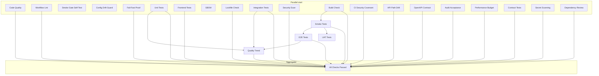

# CI quality gates — inventory

This document describes every job in [`.github/workflows/ci.yml`](../../.github/workflows/ci.yml): what it enforces, whether it blocks merges, what evidence it leaves behind, and how jobs depend on each other.

**Note:** On pull requests, `dependency-review` runs; on branch pushes it is skipped. The `all-checks` job lists explicit `needs`; jobs **not** listed there (for example `uat-tests`, `smoke-gate-selftest`, `config-drift-guard`, `sbom`) still run as part of the same workflow and should pass for a healthy pipeline—treat them as **blocking** unless their logs are explicitly advisory.

---

## Complete gate inventory

All jobs below are defined in **`CI`** (`.github/workflows/ci.yml`).

| # | Job name (GitHub) | What it checks | Blocking / Advisory | Evidence artifact (typical) |
|---|-------------------|----------------|---------------------|-----------------------------|
| 1 | **Code Quality** | Trojan-source scan; Black; isort; flake8; `validate_type_ignores`; mypy; mock-data eradication | Blocking | Console logs (no default artifact) |
| 2 | **Workflow Lint (actionlint)** | Validates `ci.yml`, `deploy-staging.yml`, `deploy-production.yml` | Blocking | actionlint output |
| 3 | **Smoke Gate Self-Test** | Self-test for `scripts/governance/runtime-smoke-gate.sh` | Blocking | Console logs |
| 4 | **Configuration Drift Guard** | Fails if forbidden legacy env string appears in pinned config/deploy files | Blocking | Console logs |
| 5 | **ADR-0002 Fail-Fast Proof** | `pytest tests/test_config_failfast.py` | Blocking | Console logs |
| 6 | **Unit Tests** | `pytest tests/unit/` with coverage floor (≥38%) | Blocking | `coverage.xml`, `junit-unit.xml` → artifacts `codecov-*`, `junit-unit-tests` |
| 7 | **Frontend Tests** | `npm ci`, lockfile coverage, `npm audit`, ESLint + jsx-a11y, Vitest + coverage, i18n check | Blocking | Console logs; coverage under `frontend/` |
| 8 | **SBOM Generation** | CycloneDX SBOM for Python env | Blocking | `sbom.json` → artifact `sbom-cyclonedx` |
| 9 | **Lockfile Freshness Check** | `requirements.lock` present and consistent with `pip-compile --generate-hashes` | Blocking | diff output on failure |
| 10 | **Integration Tests** | Alembic up/down safety; quarantine policy; `pytest tests/integration/` (≥40% cov) | Blocking | `coverage.xml`, `junit-integration.xml` → artifacts |
| 11 | **Security Scan** | Waivers validation; Bandit (high blocking); `pip-audit --strict`; Safety (non-blocking) | Mixed | Console logs |
| 12 | **Build Check** | Install prod deps; import `src.main:app` | Blocking | Console logs |
| 13 | **CI Security Covenant (Stage 2.0)** | `scripts/validate_ci_security_covenant.py` | Blocking | Console logs |
| 14 | **Smoke Tests (CRITICAL)** | After build-check: migrations + `pytest tests/smoke/`; deploy-proof script | Blocking | `junit-smoke.xml`, `deploy-proof.txt` → artifacts |
| 15 | **End-to-End Tests** | After smoke: migrations + `pytest tests/e2e/` + baseline gate vs `docs/evidence/e2e_baseline.json` | Blocking | `junit-e2e.xml` → artifact |
| 16 | **UAT Tests (User Acceptance)** | After smoke: UAT stages + stability guard | Blocking | `junit-uat-stage1.xml`, `junit-uat-stage2.xml`, `uat-summary.txt` → artifact |
| 17 | **API Path Drift Prevention** | `scripts/check_api_path_drift.py` on `tests/` | Blocking | `api_path_drift_report.json` → artifact |
| 18 | **Quality Trend Report** | After unit+integration+e2e: `scripts/generate_quality_trend.py` (runs `if: always()`) | Advisory for trend script failures; job should stay green | `quality-reports/` → artifact `quality-trend-*` (JUnit XML from sibling jobs is not downloaded into this job, so parsed counts may be zero unless artifact wiring is added) |
| 19 | **OpenAPI Contract Stability** | Generate `openapi-current.json`; compare to `openapi-baseline.json` | Blocking if baseline exists and incompatible | `openapi-current.json` → artifact `openapi-schema` |
| 20 | **Audit Acceptance Artifacts Gate** | `scripts/governance/validate_audit_acceptance_pack.py` | Blocking | Console logs |
| 21 | **Performance Budget (PR-04)** | Frontend build, `size-limit`, Lighthouse CI | Blocking | Lighthouse/size-limit output |
| 22 | **API Contract Tests** | `pytest tests/contract/` | Blocking | Console logs |
| 23 | **Dependency Review** | GitHub dependency review on PRs; `fail-on-severity: high` | Blocking on PR when run | GitHub Security tab / step summary |
| 24 | **Secret Scanning (Gitleaks)** | Repository secret scan | Blocking | gitleaks output |
| 25 | **All Checks Passed** | Aggregates listed `needs`; runs `scripts/generate_gate_summary.sh` | Blocking | `gate-summary.txt` → artifact |

---

## Gate dependencies (DAG)

Most jobs start in parallel on `push` / `pull_request`. The critical path and fan-in/fan-out are:

**Important:** `all-checks` does **not** currently list `smoke-gate-selftest`, `config-drift-guard`, `sbom`, or `uat-tests` in `needs`. Those jobs still run in parallel with the rest; failures still fail the workflow. When interpreting “merge readiness,” require **all** jobs green, not only `all-checks`’s `needs` subgraph.

---

## Adding a new gate

1. **Choose the workflow** — Add to `.github/workflows/ci.yml` (or a dedicated workflow if it is release-only).
2. **Define a `job`** with a clear `name`, `runs-on`, and `steps` (checkout, toolchain, cache).
3. **Declare `needs`** if the gate must run after migrations, smoke, or build (follow existing patterns: DB services + `alembic upgrade head`).
4. **Make failure meaningful** — Exit non-zero on violation; avoid silent `|| true` except where explicitly advisory (see Security Scan Safety step).
5. **Attach evidence** — Use `actions/upload-artifact@v4` for reports (JUnit, JSON, SARIF) with retention aligned to audit needs.
6. **Wire merge policy** — Add the job to `all-checks.needs` if it should be part of the documented aggregator (and update this doc).
7. **Update covenant / scripts** — If the repo uses `validate_ci_security_covenant.py` or similar, extend it when the gate is security-related.
8. **Document triage** — Add a row to the inventory table above and a triage bullet below.

---

## Gate failure triage

| Gate type | Common failures | How to fix |
|-----------|-----------------|------------|
| **Formatting / lint** | Black or isort drift | Run `black src/ tests/` and `isort` per `pyproject.toml`; re-run locally. |
| **flake8** | Unused imports, complexity | Fix violations or narrow exclude only with justification. |
| **mypy** | New untyped calls | Add types or fix annotations; avoid unjustified `# type: ignore` (validator enforces). |
| **Mock data gate** | Disallowed fixtures | Remove mock data per `scripts/check_mock_data.py` rules. |
| **Fail-fast proof** | Config validation relaxed | Restore production fail-fast behavior; see ADR-0002. |
| **Unit / integration** | Assertion or DB fixture failures | Read `junit-*.xml` artifact; reproduce with same pytest path and env vars as CI. |
| **Frontend** | Lockfile drift, audit, eslint, vitest | Run `npm ci` in `frontend/`; fix a11y and tests; update `package-lock.json`. |
| **Lockfile** | `requirements.lock` out of date | Run `./scripts/generate_lockfile.sh` and commit. |
| **Security (Bandit / pip-audit)** | High-severity code or dependency CVE | Patch dependency, pin safe version, or follow waiver process with `validate_security_waivers.py`. |
| **Build check** | Import-time settings / missing env | Ensure `src.main` imports with documented test env vars. |
| **Smoke / E2E** | Auth, rate limit, migration head | Check Alembic revision, `TESTING=1`, Postgres/Redis services; inspect `deploy-proof.txt`. |
| **E2E baseline** | Pass count below minimum | Fix regressions or, if intentional, update `docs/evidence/e2e_baseline.json` via governed change. |
| **API path drift** | Bare `/api/` in tests | Use `/api/v1/` per `scripts/check_api_path_drift.py`. |
| **OpenAPI** | Baseline mismatch | Regenerate and review diff; update `openapi-baseline.json` when change is approved. |
| **Contract tests** | Schema or example drift | Align `tests/contract/` with OpenAPI and implementation. |
| **Audit acceptance** | Missing pack files | Satisfy `validate_audit_acceptance_pack.py` expectations under `scripts/governance/`. |
| **Performance budget** | Bundle or Lighthouse regression | Optimize bundle or adjust limits with product approval. |
| **Gitleaks** | Secret in history | Rotate secret; remove from commits per security procedure. |
| **Dependency review** | High severity on PR | Upgrade vulnerable dependency or document exception. |
| **Config drift guard** | Forbidden hostname fragment | Replace legacy ACA reference with current staging platform URLs/paths. |

---

## References

- Workflow source: `.github/workflows/ci.yml`
- Deploy workflows (not listed as separate CI jobs): `.github/workflows/deploy-staging.yml`, `.github/workflows/deploy-production.yml`
- Gate summary script: `scripts/generate_gate_summary.sh`
