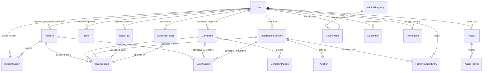

# Data Model Quality Guide (D11)

This guide summarises major domain models, relationships, shared mixins, data classification, database constraints, and naming conventions for the Quality Governance Platform.

---

## Entity overview

The diagram below is a **conceptual** entity–relationship view of the key governance entities listed in this guide. It is intended for onboarding and documentation; table and FK names in PostgreSQL may differ slightly (for example `AuditRun` / `InvestigationRun` as ORM classes).

The following table lists the primary domain models requested for governance coverage, their PostgreSQL table names, and high-level notes. Some business terms map to concrete tables with different names (called out explicitly).

| Domain model | SQLAlchemy class (typical) | Table name | Notes |
|--------------|----------------------------|------------|--------|
| **User** | `User` | `users` | Authentication, profile, tenant scope |
| **Incident** | `Incident` | `incidents` | Workplace incidents; includes `AuditTrailMixin` (`created_by_id`, `updated_by_id`) |
| **IncidentAction** | `IncidentAction` | `incident_actions` | Corrective / preventive / improvement actions |
| **Complaint** | `Complaint` | `complaints` | External complaints |
| **ComplaintAction** | `ComplaintAction` | `complaint_actions` | Follow-up actions on complaints |
| **Risk** | `Risk` | `risks` | Operational risk register rows |
| **RoadTrafficCollision** | `RoadTrafficCollision` | `road_traffic_collisions` | RTA / vehicle collision records |
| **RTAAction** | `RTAAction` | `rta_actions` | Actions linked to an RTA |
| **RunningSheetEntry** | `RunningSheetEntry` | `rta_running_sheet_entries` | Chronological RTA running-sheet notes |
| **IncidentRunningSheetEntry** | `IncidentRunningSheetEntry` | `incident_running_sheet_entries` | Chronological incident running-sheet notes |
| **ComplaintRunningSheetEntry** | `ComplaintRunningSheetEntry` | `complaint_running_sheet_entries` | Chronological complaint running-sheet notes |
| **NearMissRunningSheetEntry** | `NearMissRunningSheetEntry` | `near_miss_running_sheet_entries` | Chronological near-miss running-sheet notes |
| **Investigation** | `InvestigationRun` | `investigation_runs` | Template-based investigations (domain name “Investigation”) |
| **InvestigationAction** | — | — | No dedicated `investigation_actions` table; investigation activity is captured via `investigation_comments`, `investigation_revision_events`, and actions on the linked source entity |
| **CAPAAction** | — | — | CAPA-style work is represented by corrective/preventive **actions** on incidents, complaints, and RTAs (`incident_actions`, `complaint_actions`, `rta_actions`) and corrective-action fields on `audit_findings` |
| **Audit** | `AuditRun` | `audit_runs` | Executed audit / inspection runs |
| **AuditFinding** | `AuditFinding` | `audit_findings` | Findings raised from a run |
| **AuditTemplate** | `AuditTemplate` | `audit_templates` | Reusable audit structures |
| **Standard** | `Standard` | `standards` | ISO / framework definitions; links to `clauses`, `controls` |
| **Document** | `Document` | `documents` | DMS metadata (blob content external) |
| **EvidenceAsset** | `EvidenceAsset` | `evidence_assets` | Shared evidence/attachments across modules |
| **VehicleRegistry** | `VehicleRegistry` | `vehicle_registry` | Fleet vehicle identity and compliance |
| **DriverProfile** | `DriverProfile` | `driver_profiles` | One-to-one extension of `users` for driver accountability |
| **DriverAcknowledgement** | `DriverAcknowledgement` | `driver_acknowledgements` | Acknowledgements of defects / assignments |
| **NearMiss** | `NearMiss` | `near_misses` | Standalone near-miss workflow (separate from `IncidentType.NEAR_MISS`) |
| **Policy** | `Policy` | `policies` | Controlled policy metadata; versions in `policy_versions` |
| **Notification** | `Notification` | `notifications` | In-app / delivery-tracked notifications |

Supporting entities (not in the list above but important for joins) include `investigation_templates`, `tenants`, `roles`, `user_roles`, `audit_questions`, `audit_sections`, `audit_responses`, and junction tables created for normalised many-to-many links (for example risk–clause mappings).

---

## Key relationships

Representative cardinality and foreign keys (not exhaustive):

| From | To | Relationship |
|------|-----|----------------|
| **User** → **Incident** | `users.id` | `incidents.reporter_id`, `investigator_id`, `closed_by_id`, `sif_assessed_by_id`; audit trail `created_by_id`, `updated_by_id` via `AuditTrailMixin` |
| **Incident** → **IncidentAction** | `incidents.id` | `incident_actions.incident_id` (**1 : many**, `ON DELETE CASCADE`) |
| **User** → **IncidentAction** | `users.id` | `owner_id`, `verified_by_id` |
| **Complaint** → **ComplaintAction** | `complaints.id` | `complaint_actions.complaint_id` (**1 : many**, `ON DELETE CASCADE`) |
| **RoadTrafficCollision** → **RTAAction** | `road_traffic_collisions.id` | `rta_actions.rta_id` (**1 : many**, `ON DELETE CASCADE`) |
| **RoadTrafficCollision** → **RunningSheetEntry** | `road_traffic_collisions.id` | `rta_running_sheet_entries.rta_id` (**1 : many**, `ON DELETE CASCADE`) |
| **Incident** → **IncidentRunningSheetEntry** | `incidents.id` | `incident_running_sheet_entries.incident_id` (**1 : many**, `ON DELETE CASCADE`) |
| **Complaint** → **ComplaintRunningSheetEntry** | `complaints.id` | `complaint_running_sheet_entries.complaint_id` (**1 : many**, `ON DELETE CASCADE`) |
| **NearMiss** → **NearMissRunningSheetEntry** | `near_misses.id` | `near_miss_running_sheet_entries.near_miss_id` (**1 : many**, `ON DELETE CASCADE`) |
| **User** → **RunningSheetEntry** | `users.id` | `rta_running_sheet_entries.author_id` |
| **AuditTemplate** → **AuditRun** | `audit_templates.id` | `audit_runs.template_id` (**1 : many**) |
| **AuditRun** → **AuditFinding** | `audit_runs.id` | `audit_findings.run_id` (**1 : many**, `ON DELETE CASCADE`) |
| **InvestigationTemplate** → **InvestigationRun** | `investigation_templates.id` | `investigation_runs.template_id` (**1 : many**) |
| **InvestigationRun** → source record | polymorphic | `assigned_entity_type` + `assigned_entity_id` → incident, complaint, RTA, or near miss |
| **EvidenceAsset** → modules | logical | `source_module` + `source_id`; optional `linked_investigation_id` → `investigation_runs.id` |
| **Standard** → **Clause** | `standards.id` | `clauses.standard_id` (**1 : many**, `ON DELETE CASCADE`) |
| **Policy** → **PolicyVersion** | `policies.id` | `policy_versions.policy_id` (**1 : many**, `ON DELETE CASCADE`) |
| **User** → **DriverProfile** | `users.id` | `driver_profiles.user_id` (**1 : 1**, `unique`, `ON DELETE CASCADE`) |
| **DriverProfile** → **DriverAcknowledgement** | `driver_profiles.id` | `driver_acknowledgements.driver_profile_id` (**1 : many**, `ON DELETE CASCADE`) |
| **VehicleRegistry** → **DriverProfile** | `vehicle_registry.vehicle_reg` | `driver_profiles.allocated_vehicle_reg` (`ON DELETE SET NULL`) |
| **User** → **Notification** | `users.id` | `notifications.user_id` (**1 : many**) |

---

## Base mixins

Defined in `src/domain/models/base.py`:

| Mixin | Columns / behaviour |
|--------|----------------------|
| **TimestampMixin** | `created_at`, `updated_at` (`DateTime(timezone=True)`, indexed `created_at` where declared) |
| **ReferenceNumberMixin** | `reference_number` (`String(20)`, `unique`, indexed) — human-readable refs (e.g. audit/incident IDs) |
| **AuditTrailMixin** | `created_by_id`, `updated_by_id` (optional integers; wire to `users.id` in services/migrations) |
| **SoftDeleteMixin** | `deleted_at` (used on `User` and elsewhere where soft delete applies) |

`get_model_classification()` returns `DataClassification.C2_INTERNAL` when a model omits `__data_classification__`.

---

## Data classification (C1–C4)

Levels are declared on `DataClassification` in `src/domain/models/base.py`:

- `C1_PUBLIC` — public-safe reference material  
- `C2_INTERNAL` — internal operations data (platform default when unset)  
- `C3_CONFIDENTIAL` — confidential business/personal data  
- `C4_RESTRICTED` — highly sensitive (e.g. health, serious incident detail)

**Models that set `__data_classification__` in code (illustrative):**

| Level | Models (examples) |
|--------|-------------------|
| **C4_RESTRICTED** | `Incident`, `RoadTrafficCollision`, `Complaint` |
| **C3_CONFIDENTIAL** | `Risk` |

**Models without an explicit attribute** fall back to **C2_INTERNAL** via `get_model_classification()`. Align runtime handling with `docs/privacy/data-classification.md` for policy-level assignments (e.g. treating `Standard` / reference data as C1 in policy even when the ORM default is C2 unless overridden in code).

---

## Constraint catalog (selected)

Patterns observed across key tables; always confirm against the latest Alembic revision and live `\d` / information_schema in each environment.

### Unique constraints

- `users.email`  
- `roles.name`  
- `reference_number` on entities using **ReferenceNumberMixin** (e.g. `incidents`, `complaints`, `road_traffic_collisions`, `audit_templates`, `audit_runs`, `audit_findings`, `policies`, `investigation_runs`, action tables where the mixin applies)  
- `complaints.external_ref` (optional, for idempotent imports)  
- `audit_templates.external_id` (UUID for sync)  
- `standards.code`  
- `vehicle_registry.vehicle_reg`  
- `driver_profiles.user_id`  
- `evidence_assets.storage_key`  
- `near_misses.reference_number`  
- `notification_preferences.user_id`

### Foreign keys and `ON DELETE` policies (examples)

- **CASCADE**: child actions (`incident_actions`, `complaint_actions`, `rta_actions`) and runner-sheet tables (`incident_running_sheet_entries`, `complaint_running_sheet_entries`, `near_miss_running_sheet_entries`, `rta_running_sheet_entries`) when parent case is removed; template children (`audit_sections`, `audit_questions`, `clauses`, `policy_versions`) where declared.  
- **SET NULL**: nullable links (e.g. `clauses.parent_clause_id`, `vehicle_registry.asset_id`, `driver_profiles.allocated_vehicle_reg`) where the parent may disappear but the row should remain.

### Check / server constraints

- Enum-like fields are often implemented as `CaseInsensitiveEnum` or database enums; validation also occurs in Pydantic schemas.  
- Numeric business rules (e.g. scoring ranges) may be enforced in application layer; add explicit `CHECK` constraints in migrations when a rule must be database-enforced.

### Indexes (examples)

- Tenant-scoped listing: composite indexes such as `ix_incidents_tenant_status`, `ix_incidents_tenant_created`, `ix_complaints_tenant_status`, `ix_audit_runs_tenant_status`.  
- Evidence lookup: `ix_evidence_assets_source` on `(source_module, source_id)`.  
- Standard FK columns: `*_id` columns frequently carry `index=True` in the ORM.

For a full inventory, use Alembic history and PostgreSQL catalog queries (`pg_constraint`, `pg_indexes`).

---

## Naming conventions

- **Tables**: `snake_case`, plural or domain phrase (`incidents`, `road_traffic_collisions`, `rta_running_sheet_entries`).  
- **Primary keys**: integer `id` with `autoincrement=True` unless a natural key is intentional (e.g. `vehicle_registry.vehicle_reg` used as FK target).  
- **Foreign keys**: column name `*_id` pointing to parent `id` (or explicit natural key where designed).  
- **Consistency**: Python classes are `PascalCase`; `__tablename__` matches database naming above.

---

## Related documents

- [Data classification policy](../privacy/data-classification.md)  
- [Migration guide](./migration-guide.md)  
- [Data integrity](./data-integrity.md)
