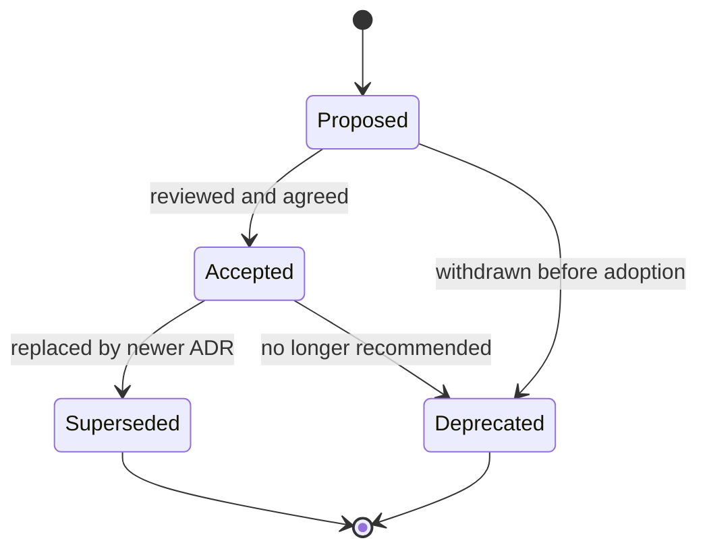

# Architecture decision records (ADR) — template and practice

Use this template for significant technical decisions. Store completed ADRs as markdown in **[docs/adr/](../adr/)** alongside the existing decision set.

---

## Decision record template

Copy the following into a new file (for example `docs/adr/NNNN-short-title.md`):

```markdown
# ADR-NNNN: <Title>

## Status

Proposed | Accepted | Superseded by ADR-XXXX | Deprecated

## Context

What problem or force are we responding to? What constraints (security, compliance,
cost, team skill, timelines) matter?

## Decision

What we decided — concrete enough that someone can implement or audit it.

## Consequences

**Positive:** what improves.

**Negative / trade-offs:** what we accept (complexity, lock-in, operational load).

**Risks:** what could go wrong and mitigations.

## Participants

Names or roles (e.g. Engineering Lead, Security, DPO) who were consulted or approved.

## Date

YYYY-MM-DD (decision date; update if status changes)
```

---

## When to write an ADR

Create an ADR when the change is **hard to reverse** or **materially affects** how we build or operate the platform:

- **Significant technology choice** — new database, framework, messaging stack, or cloud service pattern.
- **Architectural pattern** — layering, event-driven vs synchronous, multi-tenant isolation strategy.
- **Security control** — auth model change, new secret handling, data residency, encryption approach.
- **Data model change** — canonical entity definitions, retention/erasure strategy, cross-system ownership.

Small refactors, routine dependency bumps, or one-off bugfixes **do not** need an ADR unless they encode a new pattern others must follow.

---

## ADR lifecycle



| Status | Meaning |
|--------|---------|
| **Proposed** | Under discussion; not yet team standard. |
| **Accepted** | Current standard; implement and enforce. |
| **Superseded** | Replaced by a newer ADR; link both ways. |
| **Deprecated** | Do not use for new work; migrate off when touched. |

---

## Reference — existing ADRs

The repository maintains **nine** recorded decisions under **[docs/adr/](../adr/)**. Browse that directory for titles, status, and links between related ADRs (for example fail-fast configuration and CI governance).

When adding ADR-0010+, follow the same numbering and linking conventions as existing files.

---

## Related documentation

- Module boundaries: `docs/architecture/module-boundaries.md`
- CI governance: `docs/ci/gate-inventory.md`
