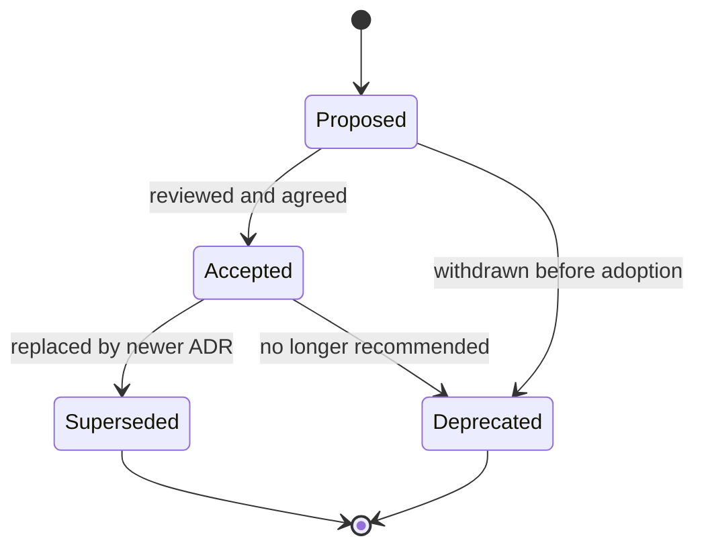

# Architecture decision records (ADR) — template and practice

Use this template for significant technical decisions. Store completed ADRs as markdown in **[docs/adr/](../adr/)** alongside the existing decision set.

---

## Decision index

| ADR | Title | Status |
| --- | --- | --- |
| [ADR-0001](../adr/ADR-0001-migration-and-ci-strategy.md) | Disciplined Database Migrations and CI-Enforced Quality Gates | Accepted |
| [ADR-0002](../adr/ADR-0002-config-failfast.md) | Production Configuration Fail-Fast | Accepted |
| [ADR-0003](../adr/ADR-0003-SWA-GATING-EXCEPTION.md) | SWA Deployment Gating Exception for Tooling PRs | Accepted |
| [ADR-0004](../adr/ADR-0004-ACA-STAGING-INFRASTRUCTURE.md) | Azure Container Apps Staging Infrastructure | Accepted |
| [ADR-0005](../adr/ADR-0005-production-dependencies.md) | Production Infrastructure Dependencies | Accepted |
| [ADR-0006](../adr/ADR-0006-environment-and-config-strategy.md) | Environment Strategy and Configuration Hardening | Accepted |
| [ADR-0007](../adr/ADR-0007-readiness-probe.md) | Readiness Probe Database Check | Accepted |
| [ADR-0008](../adr/ADR-0008-TELEMETRY-CORS-QUARANTINE.md) | Telemetry CORS Quarantine Policy | Accepted |
| [ADR-0009](../adr/ADR-0009-csrf-not-required.md) | CSRF Protection Not Required | Accepted |
| [ADR-0010](../adr/ADR-0010-backend-i18n-strategy.md) | Backend I18n Strategy | Accepted |
| [ADR-0013](../adr/ADR-0013-iac-adoption.md) | Adopt Bicep for Infrastructure-as-Code | Proposed |

---

## Decision record template

Copy the following into a new file (for example `docs/adr/NNNN-short-title.md`):

```markdown
# ADR-NNNN: <Title>

## Status

Proposed | Accepted | Superseded by ADR-XXXX | Deprecated

## Context

What problem or force are we responding to? What constraints (security, compliance,
cost, team skill, timelines) matter?

## Decision

What we decided — concrete enough that someone can implement or audit it.

## Consequences

**Positive:** what improves.

**Negative / trade-offs:** what we accept (complexity, lock-in, operational load).

**Risks:** what could go wrong and mitigations.

## Participants

Names or roles (e.g. Engineering Lead, Security, DPO) who were consulted or approved.

## Date

YYYY-MM-DD (decision date; update if status changes)
```

---

## When to write an ADR

Create an ADR when the change is **hard to reverse** or **materially affects** how we build or operate the platform:

- **Significant technology choice** — new database, framework, messaging stack, or cloud service pattern.
- **Architectural pattern** — layering, event-driven vs synchronous, multi-tenant isolation strategy.
- **Security control** — auth model change, new secret handling, data residency, encryption approach.
- **Data model change** — canonical entity definitions, retention/erasure strategy, cross-system ownership.

Small refactors, routine dependency bumps, or one-off bugfixes **do not** need an ADR unless they encode a new pattern others must follow.

---

## ADR lifecycle



| Status | Meaning |
|--------|---------|
| **Proposed** | Under discussion; not yet team standard. |
| **Accepted** | Current standard; implement and enforce. |
| **Superseded** | Replaced by a newer ADR; link both ways. |
| **Deprecated** | Do not use for new work; migrate off when touched. |

---

## Reference — existing ADRs

The repository maintains **ten** recorded decisions under **[docs/adr/](../adr/)**; see the **Decision index** above. Browse that directory for full text and links between related ADRs (for example fail-fast configuration and CI governance).

When adding ADR-0011+, follow the same numbering and linking conventions as existing files.

---

## ADR Review Cadence

All accepted ADRs are reviewed **annually** (Q1) to ensure they remain current:

1. Engineering leads review each ADR against current architecture
2. ADRs that no longer apply are marked **Deprecated** or **Superseded**
3. New ADRs are created for decisions made since the last review
4. The Decision Index above is updated after each review cycle

**Next review due**: Q1 2027

## Related documentation

- Module boundaries: `docs/architecture/module-boundaries.md`
- CI governance: `docs/ci/gate-inventory.md`
